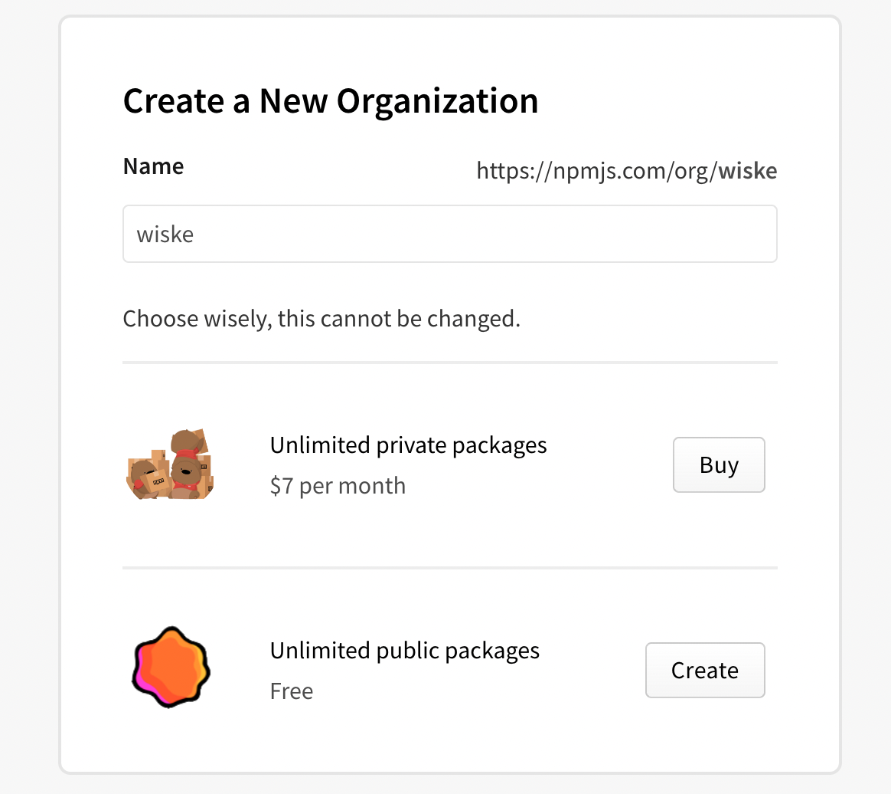

## 新建Organization

到个人主页[NPMJS](https://www.npmjs.com/settings/wiskewu/profile)找到Organizations, 点击“+”进入[create](https://www.npmjs.com/org/create)页面，输入`scoped`名称，如`wiske`:



> 注意名称无需以'@'字符开头
选择`Unlimited public packages`并点击`Create`按钮，即可完成创建。

## 更改自己包的名称

选择要发布的新包，修改`package.json`的`name`字段，如:

```json
{
    "name": "@wiske/adios-theme-default"
}
```

## 登陆NPM并发布

包一切准备就绪后，登陆npm并进行发布操作：

```bash
npm login
npm publish --access public
```

> 注意此处的`--access public`必须加，否则无法进行发布;
> 此处您的github项目链接仍然可以保持不带`scoped`，比如[这里](https://github.com/wiskewu/adios-theme-default);