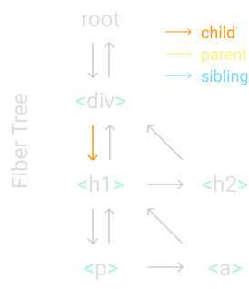
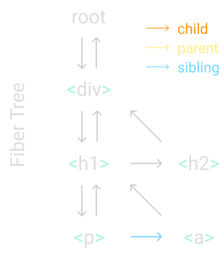

## 概要

我们将一步步地，按照实际的React架构代码（不包含优化项及非基本功能代码），从头开始重写React。

如果你之前读过相关的[构建你自己的React](https://engineering.hexacta.com/didact-learning-how-react-works-by-building-it-from-scratch-51007984e5c5)系列文章，区别是这篇文章是基于`React 16.8`, 因此我们可以使用`hooks`并去除和`classes`相关的任何代码。

你可以在这个repo-[Didact](https://github.com/pomber/didact)中找到与之前文章的一些信息及代码，同时，我们还提供了一个覆盖了相同内容的[演说视频](https://youtu.be/8Kc2REHdwnQ)，但这篇文章已经包含了所有你想知道的内容。

从零开始，在这个版本中我们将按照以下步骤逐级深入：

- 步骤一：`createElement`函数
- 步骤二：`render`函数
- 步骤三：并发模式(Concurrent Mode)
- 步骤四：渲染(Render)及提交(Commit)阶段
- 步骤五：调和(Reconciliation)
- 步骤六：函数组件
- 步骤七：钩子(Hooks)

---

## 零：回顾

首先让我们回顾一些基本概念。如果你已经对`React`、`JSX`和`DOM`元素的工作方式有了很好的了解，则可以跳过这一步。

从一个基本的`React`应用开始，我们只需三行代码。第一行声明一个`React`元素，第二行获取dom节点，第三行将元素渲染到节点上：

```jsx
const element = <h1 title="foo">Hello</h1>;
const container = document.getElementById("root");
ReactDOM.render(element, container);
```

第一行我们用`JSX`定义了React元素，但它并不是合法的JS代码，所以我们将用合法的原生JS代码去替换它, JSX由如`Babel`这类编译工具转换成JS，转换过程通过比较简单：调用`createElement`函数，传递标签名、属性、子元素作为参数，替换标签内的代码。

```js
const element = React.createElement(
  "h1",
  { title: "foo" },
  "Hello"
);
// ...
```

`React.createElement`从参数中创建出一个对象，除了一些校验之外，这就是它所作的一切了。所以我们可以安全地使用类似于它的输出对象来替换这个函数调用。

```js
const element = {
  type: "h1",
  props: {
    title: "foo",
    children: "Hello",
  },
}
// ...
```

这就是这个React元素的样貌了，一个拥有`type`和`props`两个属性的简单对象(当然了，实际上元素拥有更多属性，但我们这里只需关心这两个属性)。

`type`是一个表明待创建的dom节点元素类型的字符串，值是我们传递给`React.createElement`函数的HTML标签名。它也可以是一个函数，我们在步骤七中会讲到。

`props`是一个对象，包含了JSX属性上所有的键值，同时它也包含了一个特殊的键：`children`。

`children`在上述示例中是一个字符串，但它通常是一个包含更多元素的数组，这也就是为何React元素`elements`也是一个树`tree`。

另一个我们需要替换的代码片段是`ReactDOM.render`，`render`是React修改DOM节点的地方，我们将替换为自己的代码：

```js
const element = {
  type: "h1",
  props: {
    title: "foo",
    children: "Hello",
  },
};
​
const container = document.getElementById("root");
​
const node = document.createElement(element.type);
node["title"] = element.props.title;
​
const text = document.createTextNode("");
text["nodeValue"] = element.props.children;

node.appendChild(text);
container.appendChild(node);
```

在这个例子中，我们使用元素的`type`（此例是h1）创建节点，然后将元素的所有`props`设置到节点上（此例只有title）。

> 为避免疑惑，我们将使用"元素"指代React元素，使用"节点"指代DOM元素。

接着我们为子元素创建对应节点，此例我们只有一个字符串所以我们创建一个文本节点。使用`textNode`代替`innerText`将有助于后续我们使用相同的方式处理所有元素。同时注意此处我们是如何像给`h1`设置title般设置`nodeValue`的，让这个字符串元素看起来好像真的拥有`props: { nodeValue: "hello" }`属性一样。

最后，我们将这个文本节点添加至h1节点，h1节点添加至容器节点。

至此，我们已经使用原生JS实现和最初的React应用一样的功能。

## 壹：`creteElement`函数

让我们从另一个React应用入手，这一次我们将替换React代码为我们自己的React实现。

```jsx
const element = (
  <div id="foo">
    <a>bar</a>
    <b />
  </div>
);
const container = document.getElementById("root");
ReactDOM.render(element, container);
```

我们先从实现`createElement`开始吧，我们将转换JSX到JS，这样方便我们看到`createElement`调用过程。

```js
const element = React.createElement(
  "div",
  { id: "foo" },
  React.createElement("a", null, "bar"),
  React.createElement("b")
);
// ...
```

在上一步中我们知道，一个React元素是由`type`和`props`组成的对象。所以我们函数唯一要做的就是创建出这个对象。

```js
function createElement(type, props, ...children) {
  return {
    type,
    props: {
      ...props,
      children,
    },
  }
};

const element = createElement(
    "div",
  { id: "foo" },
  createElement("a", null, "bar"),
  createElement("b")
);
// ... 
```

我们使用剩余操作符和剩余参数语法分别设置`props`和获取`children`。这样我们的`children`属性将永远是一个数组类型。
例如，我们的`createElement`将会有如下调用和输出：

```js
createElement('div');
// { "type": "div", "props": { "children": [] } }

createElement('div', null, a);
// { "type": "div", "props": { "children": [a] } }

createElement('div', null, a, b);
// { "type": "div", "props": { "children": [a, b] } }
```

`children`数组可以包含像字符串和数字这种原始值，所以我们将创建一个特殊的类型为`TEXT_ELEMENT`的元素来包裹这些原始值。

```js
function createElement(type, props, ...children) {
  return {
    type,
    props: {
      ...props,
      children: children.map(child =>
        typeof child === "object"
          ? child
          : createTextElement(child)
      ),
    },
  }
};

function createTextElement(text) {
  return {
    type: "TEXT_ELEMENT",
    props: {
      nodeValue: text,
      children: [],
    },
  }
};
// ...
```

> React实际上并不会包裹这些原始值，当没有任何`children`时也不会创建一个空数组。但我们此处这么做是因为这将简化我们的代码，我们要实现的库代码更倾向于简单而不是高性能。

我们仍在使用`React.createElement`。为了替换它，让我们给我们的库起个名吧，这个名字不仅要听起来像React还需要有一定的教学意图含义在里头。

我们将起名为`Didact`。

```js
function createElement() { /* ... */ }

const Didact = {
    createElement,
};
const element = Didact.createElement(
  "div",
  { id: "foo" },
  Didact.createElement("a", null, "bar"),
  Didact.createElement("b")
);

const container = document.getElementById("root");
ReactDOM.render(element, container);
```

但这里我们仍然想要使用JSX语法，我们应该怎么做才能让`babel`在编译时使用我们`Didact`的`createElement`而不是React的`createElement`呢？

如果我们像下面这样添加一条注释，当`babel`编译时，它就会使用我们`Didact`的`createElement`方法：

```jsx
// ...

/** @jsx Didact.createElement */
const element = (
  <div id="foo">
    <a>bar</a>
    <b />
  </div>
);

// ...

```

---

## 贰：`render`函数

接下来，我们将重写`ReactDOM.render`为我们自己的版本。

目前，我们只需关心往DOM中添加节点，我们将在稍后处理节点更新和删除逻辑。

```js
function createElement(/* ... */) {/* ... */}

function render(element, container) {
  // TODO create dom nodes
}
​
const Didact = {
  createElement,
  render,
};
​
/** @jsx Didact.createElement */
const element = (
  <div id="foo">
    <a>bar</a>
    <b />
  </div>
);

const container = document.getElementById("root");
Didact.render(element, container);
```

我们首先使用元素类型创建DOM节点，然后将新节点添加到容器中:

```js
function render(element, container) {
  const dom = document.createElement(element.type);
​
  container.appendChild(dom);
}
```

我们递归地为每个子元素做同样的操作:

```js
element.props.children.forEach(child =>
    render(child, dom);
);
```

我们还需要处理文本元素，如果元素类型是 `TEXT_ELEMENT`，我们将创建一个文本节点而不是常规节点:

```js
const dom =
    element.type == "TEXT_ELEMENT"
      ? document.createTextNode("")
      : document.createElement(element.type);
```

我们需要做的最后一件事是将元素属性分配给对应节点:

```js
const isProperty = key => key !== "children";
Object.keys(element.props)
    .filter(isProperty)
    .forEach(name => {
        dom[name] = element.props[name];
    });
```

就这样，我们现在已经拥有一个可以将JSX渲染到DOM的库了:

```js
function createElement(type, props, ...children) {
  return {
    type,
    props: {
      ...props,
      children: children.map(child =>
        typeof child === "object" ? child : createTextElement(child)
      )
    }
  };
}

function createTextElement(text) {
  return {
    type: "TEXT_ELEMENT",
    props: {
      nodeValue: text,
      children: []
    }
  };
}

function render(element, container) {
  const dom =
    element.type == "TEXT_ELEMENT"
      ? document.createTextNode("")
      : document.createElement(element.type);
  const isProperty = key => key !== "children";
  Object.keys(element.props)
    .filter(isProperty)
    .forEach(name => {
      dom[name] = element.props[name];
    });
  element.props.children.forEach(child => render(child, dom));
  container.appendChild(dom);
}

const Didact = {
  createElement,
  render
};

/** @jsx Didact.createElement */
const element = (
  <div style="background: salmon">
    <h1>Hello World</h1>
    <h2 style="text-align:right">from Didact</h2>
  </div>
);
const container = document.getElementById("root");
Didact.render(element, container);
```

> 在[codesandbox](https://codesandbox.io/s/didact-2-k6rbj)上试一试。

---

## 叁：并发模式

但是...在我们添加更多代码前我们需要重构我们的代码。

我们递归调用中存在一个问题。

```js
function render(element, container) {
    // ...
    element.props.children.forEach(child =>
        render(child, dom);
    );
    // ...
}
```

一旦我们开始渲染，直到我们渲染完整个元素树前我们都不会停止。如果元素树很大，它可能会阻塞主线程太长时间。而如果浏览器需要做一些高优先级的事情，比如处理用户输入或保持动画的流畅性，它就必须等到渲染完成。

所以我们要把工作分成几个小单元，在完成每个单元后，如果还有什么其他需要做的(高优先级)，我们会让浏览器中断渲染:

```js
let nextUnitOfWork = null;
​
function workLoop(deadline) {
  // 是否应该暂停渲染并等待
  let shouldYield = false;
  while (nextUnitOfWork && !shouldYield) {
    nextUnitOfWork = performUnitOfWork(
      nextUnitOfWork
    );
    // 无可用空闲时间，则进入等待
    shouldYield = deadline.timeRemaining() < 1;
  }
  requestIdleCallback(workLoop);
}
​
requestIdleCallback(workLoop);
​
function performUnitOfWork(nextUnitOfWork) {
  // TODO
}
```

我们使用`requestIdleCallback`来做一个循环。你可以把`requestIdleCallback`视为`setTimeout`，但不是我们告诉它何时运行，而是浏览器在主线程空闲时运行回调。

```js
function workLoop(deadline) {
    // ...
    requestIdleCallback(workLoop);
}

requestIdleCallback(workLoop);
```

> React 已经[不再使用`requestIdleCallback`](https://github.com/facebook/react/issues/11171#issuecomment-417349573)了，现在React使用[`scheduler package`](https://github.com/facebook/react/tree/master/packages/scheduler)来实现。但对于我们理解来说，在概念上是等同的。

我们可以从`requestIdleCallback`获得一个`deadline`参数。我们可以使用它来检查在浏览器重新掌握控制权前还剩多少可利用时间。

```js
let nextUnitOfWork = null;

function workLoop(deadline) {
  let shouldYield = false;
  while (nextUnitOfWork && !shouldYield) {
    // ...
    shouldYield = deadline.timeRemaining() < 1;
  }
  // ...
}
```

截至2019年11月份，React中的并发模式还不稳定。循环的稳定版本看起来更像这样：

```js
while (nextUnitOfWork) {    
  nextUnitOfWork = performUnitOfWork(   
    nextUnitOfWork  
  );
}
```

要开始循环，我们需要设置第一个工作单元，然后编写一个`performUnitOfWork`函数，它不仅要执行工作，还要返回下一个工作单元。

```js

function workLoop(deadline) {
    // ...
    nextUnitOfWork = performUnitOfWork(
        nextUnitOfWork
    );
    // ...
}

function performUnitOfWork(nextUnitOfWork) {
  // TODO execute and return next unit
}

```

---

## 肆：Fibers

要组织这些工作单元，我们需要一种数据结构：一个`fiber`树。

对于每一个元素我们将会有一个`fiber`，每个`fiber`将会代表一个工作单元(unit of work)。


下面我将使用一个例子来讲解。

假设我们想要渲染一个像这样的元素树：

```jsx
Didact.render(
  <div>
    <h1>
      <p />
      <a />
    </h1>
    <h2 />
  </div>,
  container
);
```

在渲染时，我们将创建根`fiber`并将其设置为 `nextUnitOfWork`。剩下的工作将发生在`performUnitOfWork`函数上，我们将为每个`Fiber`做三件事：

1. 将(根)元素添加至DOM
2. 为(根)元素的子元素创建`fibers`
3. 选择下一个工作单元

`fiber`这种数据结构的目的之一是更方便地找到下一个工作单元。这也就是为什么**每个`fiber`都有一个指向子`fiber`(child)的索引、一个指向相邻`fiber`(sibling)的索引、一个指向它父`fiber`(parent)的索引**。


当我们完成对光纤的工作时，如果它有一个子`fiber`，那么该`fiber`将成为下一个工作单元。



在我们的示例中，当我们完成`div`这个`fiber`的工作时，下一个工作单元将是`h1`这个`fiber`。

如果当前`fiber`没有子`fiber`，我们将其兄弟姐妹用作下一个工作单元。



例如，`p`元素的`fiber`没有子`fiber`，所以我们在完成它后移动到`a`元素的`fiber`上作为下一个工作单元。

如果`fiber`既没有孩子也没有兄弟姐妹，我们就去找"叔叔"：父母的兄弟姐妹`fiber`。


就像示例中`a`和`h2`代表的`fiber`。

此外，如果父母没有兄弟姐妹，我们会继续向上查找父母，直到我们找到一个有兄弟姐妹的`fiber`或直到我们到达根`fiber`。如果我们到达了根`fiber`，这意味着我们已经完成了这个渲染的所有工作。

现在，让我们将上述逻辑写到代码中。

首先，让我们先将部分代码从`render`中抽离到`createDom`中，在稍后我们将会用到它:

```js
function createDOM(fiber) {
    const dom =
        fiber.type == "TEXT_ELEMENT"
        ? document.createTextNode("")
        : document.createElement(fiber.type);
​
  const isProperty = key => key !== "children";
  Object.keys(fiber.props)
    .filter(isProperty)
    .forEach(name => {
      dom[name] = fiber.props[name];
    });
​
  return dom;
}

function render(element, container) {
    // TODO: set next unit of work
}

let nextUnitOfWork = null;

// ...
```

在`render`函数中，我们将初始化`nextUnitOfWork`为当前`fiber`树的根：

```js
function render(element, container) {
  nextUnitOfWork = {
    dom: container,
    props: {
      children: [element],
    },
  };
}

let nextUnitOfWork = null;
// ...
```

然后，当浏览器就绪，它会调用我们的`workLoop`函数，我们的工作就可以从根`fiber`开始了：

```js
// ...
function workLoop(deadline) {
  let shouldYield = false;
  while (nextUnitOfWork && !shouldYield) {
    nextUnitOfWork = performUnitOfWork(
      nextUnitOfWork
    )
    shouldYield = deadline.timeRemaining() < 1;
  }
  requestIdleCallback(workLoop);
}
​
requestIdleCallback(workLoop);

function performUnitOfWork(fiber) {
  // TODO add dom node
  // TODO create new fibers
  // TODO return next unit of work
}

// ...
```

首先，我们创建一个新节点并将其添加到父节点`DOM`。我们在`Fiber.dom`属性中跟踪所属的`DOM`节点。

```js
function createDom(/* ... */) {/* ... */}

function performUnitOfWork(fiber) {
  if (!fiber.dom) {
    fiber.dom = createDom(fiber);
  }
​
  if (fiber.parent) {
    fiber.parent.dom.appendChild(fiber.dom);
  }
​
  // TODO create new fibers
  // TODO return next unit of work
}
```

紧接着我们为每个子元素创建对应的`fiber`:

```js
function performUnitOfWork(fiber) {
  // ... add dom node
​
  const elements = fiber.props.children;
  let index = 0;
  let prevSibling = null;
​
  while (index < elements.length) {
    const element = elements[index];
​
    const newFiber = {
      type: element.type,
      props: element.props,
      parent: fiber,
      dom: null,
    };
  }
​
  // TODO return next unit of work
}
```

我们将它添加到`Fiber`树中，将其设置为子节点`fiber`或兄弟节点`fiber`，具体取决于它是否是第一个子节点。

```js
function performUnitOfWork(fiber) {
  // ... add dom node
​
  const elements = fiber.props.children;
  let index = 0;
  // 记录上一个兄弟节点
  let prevSibling = null;
​
  while (index < elements.length) {
    const element = elements[index];
​
    const newFiber = {
      type: element.type,
      props: element.props,
      parent: fiber,
      dom: null,
    };

    if (index === 0) {
      fiber.child = newFiber;
    } else {
      prevSibling.sibling = newFiber;
    }
​
    prevSibling = newFiber;
    index++;
  }
​
  // TODO return next unit of work
}
```

最后我们寻找下一个工作单元。我们首先检查孩子`fiber`, 然后检查兄弟姐妹`fiber`，然后检查叔叔`fiber`，依次循环。

```js
function performUnitOfWork(fiber) {
    // ... add dom node
    // ... create new fibers
    if (fiber.child) {
        return fiber.child;
    }
    let nextFiber = fiber;
    while (nextFiber) {
        if (nextFiber.sibling) {
        return nextFiber.sibling;
        }
        nextFiber = nextFiber.parent;
    }
}
```

至此，我们已经完成我们的`performUnitOfWork`函数核心代码：

```js
function performUnitOfWork(fiber) {
  if (!fiber.dom) {
    fiber.dom = createDom(fiber);
  }
​
  if (fiber.parent) {
    fiber.parent.dom.appendChild(fiber.dom);
  }
​
  const elements = fiber.props.children;
  let index = 0;
  let prevSibling = null;
​
  while (index < elements.length) {
    const element = elements[index];
​
    const newFiber = {
      type: element.type,
      props: element.props,
      parent: fiber,
      dom: null,
    };
​
    if (index === 0) {
      fiber.child = newFiber;
    } else {
      prevSibling.sibling = newFiber;
    }
​
    prevSibling = newFiber;
    index++;
  }
​
  if (fiber.child) {
    return fiber.child;
  }
  let nextFiber = fiber;
  while (nextFiber) {
    if (nextFiber.sibling) {
      return nextFiber.sibling;
    }
    nextFiber = nextFiber.parent;
  }
}
```

---

## 伍：Render与Commit阶段

这里我们又有一个问题，每次我们处理一个元素时，我们都会向DOM添加一个新节点。但请记住，浏览器可能会在我们完成渲染整个树之前中断我们的工作。在这种情况下，用户将看到一个不完整的`UI`。这样的结果显然不是我们想要的。

```js
function performUnitOfWork(fiber) {
    // ...
    if (fiber.parent) {
        fiber.parent.dom.appendChild(fiber.dom);
    }
    // ...
}
```

所以这里我们需要删除改变DOM的代码部分：

```js
function performUnitOfWork(fiber) {
    // ...
    /* remove
    if (fiber.parent) {
        fiber.parent.dom.appendChild(fiber.dom);
    }
    */
    // ...
}
```

相反，我们将跟踪`fiber`的根，并将其称为'进行中的根'或`wipRoot`。

```js
function render(element, container) {
    // ...
    wipRoot = {
    dom: container,
    props: {
      children: [element],
    },
  };
  nextUnitOfWork = wipRoot;
}

let nextUnitOfWork = null;
let wipRoot = null;
// ...
```

然后一旦我们完成了所有工作(我们知道何时完成，因为没有下一个待处理的工作单元)，我们提交整个`fiber`树到DOM。

```js
function commitRoot() {
    // TODO: add nodes to dom
}

function render(/* ... */){}

let nextUnitOfWork = null;
let wipRoot = null;

function workLoop(deadline) {
  let shouldYield = false;
  while (nextUnitOfWork && !shouldYield) {
    nextUnitOfWork = performUnitOfWork(
      nextUnitOfWork
    );
    shouldYield = deadline.timeRemaining() < 1;
  }
​
  if (!nextUnitOfWork && wipRoot) {
    // finish all. commit to dom
    commitRoot();
  }
​
  requestIdleCallback(workLoop);
}
​
requestIdleCallback(workLoop);
// ...
```

我们将在`commitRoot`这个函数中完成提交工作，这里我们会递归地将所有节点追加到DOM。

```js
function commitRoot() {
    commitWork(wipRoot.child);
    wipRoot = null;
}

function commitWork(fiber) {
    if (!fiber) {
        return
    }
    const domParent = fiber.parent.dom;
    domParent.appendChild(fiber.dom);
    commitWork(fiber.child);
    commitWork(fiber.sibling);
}

```

---

### 陆：调和(Reconciliation)

到目前为止，我们只向 DOM 添加了东西，但是更新或删除节点呢？

这就是我们现在要做的，我们需要将我们在`render`函数中收到的元素与我们提交给 DOM 的最后一个`fiber`树进行比较。

因此，我们需要在完成提交后保存对"我们提交给 DOM 的最后一个`fiber`树"的引用。我们称之为`currentRoot`。

```js
function commitRoot() {
  commitWork(wipRoot.child);
  currentRoot = wipRoot;
  wipRoot = null;
}

function render(element, container) {
    wipRoot = {
        dom: container,
        props: {
        children: [element],
        },
        alternate: currentRoot,
    }
    nextUnitOfWork = wipRoot;
}

let currentRoot = null;
//...
```

同时我们为每个`fiber`添加一个新的`alternate`属性。这个属性链接到一个旧的`fiber`节点，该节点存的是上一次提交阶段我们提交给DOM的内容。

现在，让我们从`performUnitOfWork`函数中提取那些创建新`fiber`的代码块至一个新的`reconcileChildren`函数。

```js
function performUnitOfWork(fiber) {
    if (!fiber.dom) {
        fiber.dom = createDom(fiber);
    }
    ​
    const elements = fiber.props.children;
    reconcileChildren(fiber, elements);
​   // ...
}

function reconcileChildren(wipFiber, elements) {
  let index = 0;
  let prevSibling = null;
​
  while (index < elements.length) {
    const element = elements[index];
​
    const newFiber = {
      type: element.type,
      props: element.props,
      parent: wipFiber,
      dom: null,
    };
​
    if (index === 0) {
      wipFiber.child = newFiber;
    } else {
      prevSibling.sibling = newFiber;
    }
​
    prevSibling = newFiber;
    index++;
  }
}
// ...
```

在这个函数中我们将会调和旧的`fiber`与新的`fiber`之间的关系。

我们同时迭代旧`Fiber`(存于`wipFiber.alternate`) 的子节点和我们想要协调的元素数组。

如果我们忽略了同时遍历一个数组和一个链表所需的所有模板，`while`循环内我们就只剩下内最重要的两样东西：`oldFiber`和`element`。**`element`是我们要渲染到DOM中的东西，`oldFiber`是我们上次渲染的东西**。

```js
function reconcileChildren(wipFiber, elements) {
    let index = 0;
    let oldFiber =
    wipFiber.alternate && wipFiber.alternate.child;
    let prevSibling = null;
    while(index < elements.length ||
    oldFiber != null) {
        const element = elements[index];
        let newFiber = null;
​
        // TODO compare oldFiber to element
        // ...
    }
    // ...
}
```

我们需要比较它们，看看是否需要对 DOM 进行任何更改。

我们使用类型来比较它们：

- 如果旧的`Fiber`和新的元素具有相同的类型，我们可以保留 DOM 节点并使用新的`props`更新它
- 如果类型不同并且有一个新元素，则意味着我们需要创建一个新的 DOM 节点
- 如果类型不同并且有`oldFiber`，我们需要删除旧节点

```js
function reconcileChildren(wipFiber, elements) {
    let index = 0;
    let oldFiber =
        wipFiber.alternate && wipFiber.alternate.child;
    let prevSibling = null;
    while (index < elements.length ||
    oldFiber != null) {
        const element = elements[index];
        let newFiber = null;
​
        const sameType =
            oldFiber &&
            element &&
            element.type == oldFiber.type;
​
        if (sameType) {
        // TODO update the node
        }
        if (element && !sameType) {
        // TODO add this node
        }
        if (oldFiber && !sameType) {
        // TODO delete the oldFiber's node
        }
        // ...
    }
    // ...
}
```

> 这里 React 还使用了`key`，这可以更好地协调。例如，它检测子元素何时改变在元素数组中的位置。

当旧的`Fiber`和元素的类型相同时，我们创建一个新的`Fiber`，保留旧`Fiber`的DOM节点和元素的`props`。

```js
function reconcileChildren(wipFiber, elements) {
    let index = 0;
    let oldFiber =
        wipFiber.alternate && wipFiber.alternate.child;
    let prevSibling = null;
    while (index < elements.length ||
    oldFiber != null) {
        const element = elements[index];
        let newFiber = null;
        const sameType =
            oldFiber &&
            element &&
            element.type == oldFiber.type;
​
        if (sameType) {
            newFiber = {
                type: oldFiber.type,
                props: element.props,
                dom: oldFiber.dom,
                parent: wipFiber,
                alternate: oldFiber,
                effectTag: "UPDATE",
            };
        }
        // ...
    }
}
```

我们还为`fiber`添加了一个新属性：`effectTag`。我们稍后会在提交阶段使用这个属性。

然后对于元素需要新 DOM 节点的情况，我们使用`PLACEMENT`的`effectTag`来标记新`fiber`。

```js
function reconcileChildren(/* ... */) {
    // ...
    while(/* ... */) {
        // ...
        if (sameType) {/* ... */}
        if (element && !sameType) {
            newFiber = {
                type: element.type,
                props: element.props,
                dom: null,
                parent: wipFiber,
                alternate: null,
                effectTag: "PLACEMENT",
            };
        }
        // ...
    }
}
```

而对于我们需要删除节点的情况，我们没有新的`fiber`，所以我们将`effectTag`添加到旧`effectTag`上。 当我们将`fiber`树提交到 DOM 时，我们会从'正在进行的工作根'(它没有旧`fiber`)中进行删除节点的操作。

所以我们需要一个数组来跟踪我们想要删除的节点。

```js

function render(/* ... */) {
    // ...
    deletions = [];
    // ...
}

// ...
let deletions = null;

function reconcileChildren(/* ... */) {
    // ...
    while(/* ... */) {
        // ...
        if (sameType) {/* ... */}
        if (element && !sameType) {/* ... */}
        if (oldFiber && !sameType) {
            oldFiber.effectTag = "DELETION";
            deletions.push(oldFiber);
        }
        // ...
    }
}
```

然后，当我们提交对 DOM 的更改时，我们使用该数组中的`fiber`进行删除节点的操作。

```js
function commitRoot() {
    deletions.forEach(commitWork);
    commitWork(wipRoot.child);
    currentRoot = wipRoot;
    wipRoot = null;
}
// ...
```

现在，让我们更改`commitWork`函数来处理新的 `effectTag`。

```js
function commitWork(fiber) {
    if (!fiber) {
        return
    }
    const domParent = fiber.parent.dom;
   if (
        fiber.effectTag === "PLACEMENT" &&
        fiber.dom != null
    ) {
        domParent.appendChild(fiber.dom);
    } else if (
        fiber.effectTag === "UPDATE" &&
        fiber.dom != null
    ) {
    updateDom(
      fiber.dom,
      fiber.alternate.props,
      fiber.props
    );
  } else if (fiber.effectTag === "DELETION") {
        domParent.removeChild(fiber.dom);
    }
    commitWork(fiber.child);
    commitWork(fiber.sibling);
}

function updateDom(dom, prevProps, nextProps) {
  // TODO
}​
```

如果`fiber`有`PLACEMENT`标签，我们和之前一样，将 DOM 节点附加到父`fiber`的节点上。

如果是`DELETION`，我们做相反的事情，删除该节点。

如果是`UPDATE`，我们需要用发生改变的`props`更新现有的 DOM 节点(我们在`updateDom`函数中处理这块逻辑)。

我们将旧`Fiber`的`props`与新`Fiber`的`props`进行比较，移除掉掉的`props`，设置新的或更改的`props`。

```js
const isProperty = key => key !== "children";

const isNew = (prev, next) => key =>
  prev[key] !== next[key];

const isGone = (prev, next) => key => !(key in next);

function updateDom(dom, prevProps, nextProps) {
    // 移除旧的不再使用的属性
    Object.keys(prevProps)
        .filter(isProperty)
        .filter(isGone(prevProps, nextProps))
        .forEach(name => {
        dom[name] = "";
        });
    ​
    // 设置新的或改变的属性
    Object.keys(nextProps)
        .filter(isProperty)
        .filter(isNew(prevProps, nextProps))
        .forEach(name => {
        dom[name] = nextProps[name];
        });
}
```

我们需要更新的一种特殊类型的属性是事件监听器，因此如果属性键名以"on"前缀开头，我们将以不同的方式处理它们。

```js
const isEvent = key => key.startsWith("on");

const isProperty = key =>
  key !== "children" && !isEvent(key);

const isNew = (prev, next) => key =>
  prev[key] !== next[key];

const isGone = (prev, next) => key => !(key in next);

function updateDom(/* ... */) {}
```

如果事件处理程序发生更改，我们将其从节点中删除。

```js
// ...
function updateDom(dom, prevProps, nextProps) {
    // 移除旧的或者发生更新的事件监听器
    Object.keys(prevProps)
        .filter(isEvent)
        .filter(
        key =>
            !(key in nextProps) ||
            isNew(prevProps, nextProps)(key)
        )
        .forEach(name => {
        const eventType = name
            .toLowerCase()
            .substring(2);
        // 对于同一事件类型，仍需移除旧的再添加新的
        dom.removeEventListener(
            eventType,
            prevProps[name]
        );
    });

    // ...
}
```

然后我们添加新的事件监听器：

```js
function updateDom(dom, prevProps, nextProps) {
    // ...
    // 添加新的事件监听器
    Object.keys(nextProps)
        .filter(isEvent)
        .filter(isNew(prevProps, nextProps))
        .forEach(name => {
        const eventType = name
            .toLowerCase()
            .substring(2);
        // 对于同一事件类型，仍需移除旧的再添加新的
        dom.addEventListener(
            eventType,
            nextProps[name]
        );
    });
    // ...
}
```

> 可以[在此](https://codesandbox.io/s/didact-6-96533)尝试新版本的调和功能。

---

## 柒：函数组件

下一件我们要做的事是增加对函数组件的支持。

首先修改一下示例，我们将使用最简单的函数组件，只返回一个`h1`元素。

```jsx
const Didact = {
  createElement,
  render,
}
​
/** @jsx Didact.createElement */
function App(props) {
  return <h1>Hi {props.name}</h1>
}
const element = <App name="foo" />;
const container = document.getElementById("root");
Didact.render(element, container);
```

请记住当我们将JSX转换为JS时，代码看起来像这样：

```js
function App(props) {
  return Didact.createElement(
    "h1",
    null,
    "Hi ",
    props.name
  );
}
const element = Didact.createElement(App, {
  name: "foo",
});

```

函数组件主要有两个不同点：

- 来自函数组件的`fiber`没有dom节点
- 子元素来自函数组件运行的结果，而不是直接从`props`中获取

```js
// old code
function performUnitOfWork(fiber) {
    if (!fiber.dom) {
        fiber.dom = createDom(fiber)
    }
    ​
    const elements = fiber.props.children
    reconcileChildren(fiber, elements);
    // ...
}
```

所以，我们将会检测`fiber`的类型是不是一个函数组件，并且基于此判断我们将会使用不同的函数来更新处理：

```js
function performUnitOfWork(fiber) {
    const isFunctionComponent =
        fiber.type instanceof Function
    if (isFunctionComponent) {
        updateFunctionComponent(fiber)
    } else {
        updateHostComponent(fiber)
    }
    // ...
}
​
function updateFunctionComponent(fiber) {
  // TODO
}


function updateHostComponent(fiber) {
  if (!fiber.dom) {
    fiber.dom = createDom(fiber)
  }
  reconcileChildren(fiber, fiber.props.children);
}
```

在`updateHostComponent`函数中我们做的事情和之前完全一样。

而在`updateFunctionComponent`函数中，我们将会运行此函数组件并获取到`children`：

```js
function updateFunctionComponent(fiber) {
    const children = [fiber.type(fiber.props)];
    reconcileChildren(fiber, children);
}
```

在我们的示例中，这里的`fiber.type`是`App`函数，当我们运行它时，它会返回`h1`元素。 然后，一旦我们有了子元素，调和就会以同样的方式进行，我们不需要在那里修改任何代码。

我们还需要修改的是`commitWork`函数。

```js
function commitWork(fiber) {
    if (!fiber) {
        return;
    }
    ​
    const domParent = fiber.parent.dom;
    if (
        fiber.effectTag === "PLACEMENT" &&
        fiber.dom != null
    ) {
        domParent.appendChild(fiber.dom);
    } else if (
        fiber.effectTag === "UPDATE" &&
        fiber.dom != null
    ) {
        updateDom(
        fiber.dom,
        fiber.alternate.props,
        fiber.props
        );
    } else if (fiber.effectTag === "DELETION") {
        domParent.removeChild(fiber.dom);
    }
    ​
    commitWork(fiber.child);
    commitWork(fiber.sibling);
}
```

现在我们有了没有 DOM 节点的`fiber`，我们需要修改两个地方：

第一步，要找到当前待挂载 DOM 节点的父节点，我们需要循环向上查找直到我们找到一个包含有效dom节点的`fiber`节点:

```js
function commitWork(fiber) {
    if (!fiber) {
        return;
    }
    let domParentFiber = fiber.parent;​
    while (!domParentFiber.dom) {
        domParentFiber = domParentFiber.parent;
    }
    const domParent = domParentFiber.dom;
    if (
        fiber.effectTag === "PLACEMENT" &&
        fiber.dom != null
    ) {
        domParent.appendChild(fiber.dom);
    } else if (/* ... */) {
        // ...
    } else if (/* ... */) {
        // ...
    }
    ​// ...
}
```

第二步，当移除一个节点时，我们还需要继续移除，直到我们找到一个带有 DOM 节点的子节点：

```js
function commitWork(fiber) {
    // ...
    if (/* ... */) {
        // ...
    } else if (/* ... */) {
        // ...
    } else if (fiber.effectTag === "DELETION") {
        commitDeletion(fiber, domParent);
    }
    ​// ...
}


function commitDeletion(fiber, domParent) {
    if (fiber.dom) {
        domParent.removeChild(fiber.dom);
    } else {
        commitDeletion(fiber.child, domParent);
    }
}
```

---

## 捌：Hooks

我们继续，现在我们有了函数组件，让我们为其添加状态吧。

```jsx
const Didact = {
  createElement,
  render,
  useState,
}
​
/** @jsx Didact.createElement */
function Counter() {
  const [state, setState] = Didact.useState(1)
  return (
    <h1 onClick={() => setState(c => c + 1)}>
      Count: {state}
    </h1>
  );
}

const element = <Counter />;
const container = document.getElementById("root");
Didact.render(element, container);

```

让我们将示例代码更改为经典的计数器组件。每次我们单击它时，它都会将状态加一。 请注意，我们使用`Didact.useState`来获取和更新计数器值。

这里是我们从示例代码中调用`Counter`函数的地方。在该函数内部，我们调用`useState`:

```js
function updateFunctionComponent(fiber) {
    const children = [fiber.type(fiber.props)];
    reconcileChildren(fiber, children);
}
​
function useState(initial) {
  // TODO
}
```

我们需要在调用函数组件之前初始化一些全局变量，以便我们可以在`useState`函数中使用它们。

首先设置'进行中的fiber'：

```js
let wipFiber = null;
let hookIndex = null;
function updateFunctionComponent(fiber) {
  wipFiber = fiber;
  hookIndex = 0;
  wipFiber.hooks = [];
  const children = [fiber.type(fiber.props)];
  reconcileChildren(fiber, children);
}
function useState(initial) {
  // TODO
}
```

我们还在`Fiber`中添加了一个`hooks`数组，以支持在同一个组件中多次调用`useState`,我们会跟踪当前的钩子索引。

当函数组件调用`useState`时，我们使用钩子的索引在`fiber.alternate`中检查是否有旧的`hooks`。

如果我们有一个旧的`hooks`，我们就把状态从旧的钩子复制到新的钩子上，若没有，则初始化这个状态。

然后我们将新的`hooks`添加到`fiber`中，将钩子的索引增加1，并返回状态:

```js
function useState(initial) {
    const oldHook =
        wipFiber.alternate &&
        wipFiber.alternate.hooks &&
        wipFiber.alternate.hooks[hookIndex];
    const hook = {
        state: oldHook ? oldHook.state : initial,
    };
    ​
    wipFiber.hooks.push(hook);
    hookIndex++;
    return [hook.state];
}
```

`useState`还应该返回一个函数来更新状态，所以我们定义了一个`setState`函数来接收一个动作（对于`Counter`示例，这个动作是一个将状态加一的函数）。

我们为钩子创建一个队列，并将动作添加至该队列中。

然后我们做一些类似于我们在渲染函数中所做的事情，将一个新的正在进行的工作根设置为下一个工作单元，这样工作循环就可以开始一个新的渲染阶段：

```js
function useState(initial) {
    const oldHook =
        wipFiber.alternate &&
        wipFiber.alternate.hooks &&
        wipFiber.alternate.hooks[hookIndex];
    const hook = {
        state: oldHook ? oldHook.state : initial,
    };
    ​
    const setState = action => {
        hook.queue.push(action);
        wipRoot = {
            dom: currentRoot.dom,
            props: currentRoot.props,
            alternate: currentRoot,
        };
        nextUnitOfWork = wipRoot;
        deletions = [];
    };
    wipFiber.hooks.push(hook);
    hookIndex++;
    return [hook.state, setState];
}
```

但我们还缺少对动作的执行操作。

我们在下一次渲染组件时执行动作，我们从旧的钩子队列中获取所有动作，然后将它们一一应用到新的钩子状态，所以当我们返回状态时，它会是更新后的最新值:

```js
function useState(initial) {
    const oldHook =
        wipFiber.alternate &&
        wipFiber.alternate.hooks &&
        wipFiber.alternate.hooks[hookIndex];
    const hook = {
        state: oldHook ? oldHook.state : initial,
    };
    ​
    const actions = oldHook ? oldHook.queue : [];
    actions.forEach(action => {
        // 多次调用可使用最新的值
        hook.state = action(hook.state);
    });

    const setState = action => {
        // ...
    };
    wipFiber.hooks.push(hook);
    hookIndex++;
    return [hook.state, setState];
}
```

就这样。我们已经构建了自己的`React`版本。 您可以在[codesandbox](https://codesandbox.io/s/didact-8-21ost)或[github](https://github.com/pomber/didact)上使用它:

```js

function createElement(type, props, ...children) {
  return {
    type,
    props: {
      ...props,
      children: children.map(child =>
        typeof child === "object"
          ? child
          : createTextElement(child)
      ),
    },
  };
}
​
function createTextElement(text) {
  return {
    type: "TEXT_ELEMENT",
    props: {
      nodeValue: text,
      children: [],
    },
  };
}
​
function createDom(fiber) {
  const dom =
    fiber.type == "TEXT_ELEMENT"
      ? document.createTextNode("")
      : document.createElement(fiber.type);
​
  updateDom(dom, {}, fiber.props);
​
  return dom;
}
​
const isEvent = key => key.startsWith("on");

const isProperty = key =>
  key !== "children" && !isEvent(key);

const isNew = (prev, next) => key =>
  prev[key] !== next[key];

const isGone = (prev, next) => key => !(key in next);

function updateDom(dom, prevProps, nextProps) {
  //Remove old or changed event listeners
  Object.keys(prevProps)
    .filter(isEvent)
    .filter(
      key =>
        !(key in nextProps) ||
        isNew(prevProps, nextProps)(key)
    )
    .forEach(name => {
      const eventType = name
        .toLowerCase()
        .substring(2);
      dom.removeEventListener(
        eventType,
        prevProps[name]
      );
    });
​
  // Remove old properties
  Object.keys(prevProps)
    .filter(isProperty)
    .filter(isGone(prevProps, nextProps))
    .forEach(name => {
      dom[name] = "";
    });
​
  // Set new or changed properties
  Object.keys(nextProps)
    .filter(isProperty)
    .filter(isNew(prevProps, nextProps))
    .forEach(name => {
      dom[name] = nextProps[name];
    });
​
  // Add event listeners
  Object.keys(nextProps)
    .filter(isEvent)
    .filter(isNew(prevProps, nextProps))
    .forEach(name => {
      const eventType = name
        .toLowerCase()
        .substring(2);
      dom.addEventListener(
        eventType,
        nextProps[name]
      );
    })
}
​
function commitRoot() {
  deletions.forEach(commitWork);
  commitWork(wipRoot.child);
  currentRoot = wipRoot;
  wipRoot = null;
}
​
function commitWork(fiber) {
  if (!fiber) {
    return;
  }
​
  let domParentFiber = fiber.parent;
  while (!domParentFiber.dom) {
    domParentFiber = domParentFiber.parent;
  }
  const domParent = domParentFiber.dom;
​
  if (
    fiber.effectTag === "PLACEMENT" &&
    fiber.dom != null
  ) {
    domParent.appendChild(fiber.dom);
  } else if (
    fiber.effectTag === "UPDATE" &&
    fiber.dom != null
  ) {
    updateDom(
      fiber.dom,
      fiber.alternate.props,
      fiber.props
    );
  } else if (fiber.effectTag === "DELETION") {
    commitDeletion(fiber, domParent);
  }
​
  commitWork(fiber.child);
  commitWork(fiber.sibling);
}
​
function commitDeletion(fiber, domParent) {
  if (fiber.dom) {
    domParent.removeChild(fiber.dom);
  } else {
    commitDeletion(fiber.child, domParent);
  }
}
​
function render(element, container) {
  wipRoot = {
    dom: container,
    props: {
      children: [element],
    },
    alternate: currentRoot,
  };
  deletions = [];
  nextUnitOfWork = wipRoot;
}
​
let nextUnitOfWork = null;
let currentRoot = null;
let wipRoot = null;
let deletions = null;
​
function workLoop(deadline) {
  let shouldYield = false;
  while (nextUnitOfWork && !shouldYield) {
    nextUnitOfWork = performUnitOfWork(
      nextUnitOfWork
    );
    shouldYield = deadline.timeRemaining() < 1;
  }
​
  if (!nextUnitOfWork && wipRoot) {
    commitRoot();
  }
​
  requestIdleCallback(workLoop);
}
​
requestIdleCallback(workLoop);
​
function performUnitOfWork(fiber) {
  const isFunctionComponent =
    fiber.type instanceof Function;
  if (isFunctionComponent) {
    updateFunctionComponent(fiber);
  } else {
    updateHostComponent(fiber);
  }
  if (fiber.child) {
    return fiber.child;
  }
  let nextFiber = fiber;
  while (nextFiber) {
    if (nextFiber.sibling) {
      return nextFiber.sibling;
    }
    nextFiber = nextFiber.parent;
  }
}
​
let wipFiber = null;
let hookIndex = null;
​
function updateFunctionComponent(fiber) {
  wipFiber = fiber;
  hookIndex = 0;
  wipFiber.hooks = [];
  const children = [fiber.type(fiber.props)];
  reconcileChildren(fiber, children);
}
​
function useState(initial) {
  const oldHook =
    wipFiber.alternate &&
    wipFiber.alternate.hooks &&
    wipFiber.alternate.hooks[hookIndex];
  const hook = {
    state: oldHook ? oldHook.state : initial,
    queue: [],
  };
​
  const actions = oldHook ? oldHook.queue : [];
  actions.forEach(action => {
    hook.state = action(hook.state)
  });
​
  const setState = action => {
    hook.queue.push(action);
    wipRoot = {
      dom: currentRoot.dom,
      props: currentRoot.props,
      alternate: currentRoot,
    };
    nextUnitOfWork = wipRoot;
    deletions = [];
  }
​
  wipFiber.hooks.push(hook);
  hookIndex++;
  return [hook.state, setState];
}
​
function updateHostComponent(fiber) {
  if (!fiber.dom) {
    fiber.dom = createDom(fiber);
  }
  reconcileChildren(fiber, fiber.props.children);
}
​
function reconcileChildren(wipFiber, elements) {
  let index = 0;
  let oldFiber =
    wipFiber.alternate && wipFiber.alternate.child;
  let prevSibling = null;
​
  while (
    index < elements.length ||
    oldFiber != null
  ) {
    const element = elements[index];
    let newFiber = null;
​
    const sameType =
      oldFiber &&
      element &&
      element.type == oldFiber.type;
​
    if (sameType) {
      newFiber = {
        type: oldFiber.type,
        props: element.props,
        dom: oldFiber.dom,
        parent: wipFiber,
        alternate: oldFiber,
        effectTag: "UPDATE",
      };
    }
    if (element && !sameType) {
      newFiber = {
        type: element.type,
        props: element.props,
        dom: null,
        parent: wipFiber,
        alternate: null,
        effectTag: "PLACEMENT",
      };
    }
    if (oldFiber && !sameType) {
      oldFiber.effectTag = "DELETION";
      deletions.push(oldFiber);
    }
​
    if (oldFiber) {
      oldFiber = oldFiber.sibling;
    }
​
    if (index === 0) {
      wipFiber.child = newFiber;
    } else if (element) {
      prevSibling.sibling = newFiber;
    }
​
    prevSibling = newFiber;
    index++;
  }
}
​
const Didact = {
  createElement,
  render,
  useState,
};
​
/** @jsx Didact.createElement */
function Counter() {
  const [state, setState] = Didact.useState(1)
  return (
    <h1 onClick={() => setState(c => c + 1)}>
      Count: {state}
    </h1>
  );
}
const element = <Counter />;
const container = document.getElementById("root");
Didact.render(element, container);
```

---

## 结语

除了帮助您了解 React 的工作原理之外，这篇文章的目标之一是让您更轻松地深入研究 React 代码库。这就是为什么我们几乎在所有地方都使用相同的变量和函数名称。

例如，如果你在一个真正的 React 应用程序中的一个函数组件中添加一个断点，调用堆栈应该会显示：

- workLoop
- performUnitOfWork
- updateFunctionComponent

我们没有包含很多 React 特性和优化。例如，以下是 React 做的一些不同的事情:

- 在`Didact`中，我们在渲染阶段遍历整个树。相反，`React`遵循一些提示和启发式方法来跳过没有任何变化的整个子树。
- 我们还在提交阶段遍历整个树。 React 保留了一个链表，其中仅包含具有`effectTag`的`fiber`，并且仅访问这些`fibers`。
- 每次我们构建一个新的工作树时，我们都会为每个`fiber`创建新对象。 React 从旧的树中回收`fiber`。
- 当`Didact`在渲染阶段收到新的更新时，它会丢弃正在进行的工作树并从根重新开始; React 使用过期时间戳标记每个更新，并使用它来决定哪个更新具有更高的优先级。
- 还有更多不同...

你还可以轻松添加一些功能：

- 使用一个对象来表示`style`属性
- [子元素扁平化](https://github.com/pomber/didact/issues/11)
- `useEffect`钩子
- 通过`key`进行调和

如果你向`Didact`添加任何这些或其他功能，请到github仓库发起PR，以便其他人可以看到它。

感谢阅读！

### 参考链接

- [build-your-own-react](https://pomb.us/build-your-own-react/)
