## 简介

`Command Line API`是`Google Chrome`浏览器为开发者提供的执行常见任务的工具函数集合。包含了一些快捷函数用于快速选择和审查DOM元素、启动和停止分析器、监听DOM事件等。

## 快速开始

`Command Line API`仅能在`Chrome DevTools Console`中使用。如果尝试在脚本中调用它们，它们将无法工作。

可以使用下述方式快速了解当前Chrome提供了哪些Command Line API：

1. 创建以下html文件：

    ```html
    <!DOCTYPE html>
    <html lang="en">
    <head>
        <meta charset="UTF-8">
        <meta name="viewport" content="width=device-width, initial-scale=1.0">
        <title>Document</title>
    </head>
    <body>
        <script>
            var keyList = Reflect.ownKeys(window);
        </script>
    </body>
    </html>
    ```

2. 使用chrome打开上述html，并打开调试控制台，输入以下内容：

    ```js
    var keyList2 = Reflect.ownKeys(window);
    keyList2.filter(key=>!keyList.includes(key));
    ```

3. 回车即可得到当前chrome提供的所有内置Command Line API

(上述原理实际上就是因为在调试控制台可以获取到挂载在window下特有的属性，而在普通脚本里是获取不到的)

接下来，让我们逐个了解这些API吧。

## \$_

`$_`返回最近一次计算表达式执行的结果。


## \$0 - \$4

**开发者工具**会缓存我们在**元素**选项卡（或配置文件面板）中选择的最后五个 DOM 元素（或 JavaScript 堆对象）, 并分别使用`$0`、`$1`、`$2`、`$3`、`$4`表示。

其中，`$0`表示上一次选择的元素或JS对象，`$1`表示倒数第二次选择的元素或JS对象，并依次类推，`$4`表示倒数第五次选择元素或JS对象。

如下图，从上至下依次点击dom节点，查看缓存的节点内容：


## \$(selector)

`$`提供类似于`JQuery`的选择器功能，返回特定 CSS 选择器代表的第一个 DOM 节点元素。这个函数实际上是`document.querySelector()`的别名。


## \$$(selector)

与`$`类似，`$$`作为`document.querySelectorAll()`的别名函数，返回匹配给定 CSS 选择器的 DOM 元素集合。


## \$x(xpath)

返回匹配给定`XPath`的 DOM 节点集合。


> XPath语法可参见[此处](https://www.runoob.com/xpath/xpath-tutorial.html)

## clear()

清除控制台内容。与`console.clear()`等价。

## copy(object)

将指定对象以字符串表示形式复制到剪贴板。

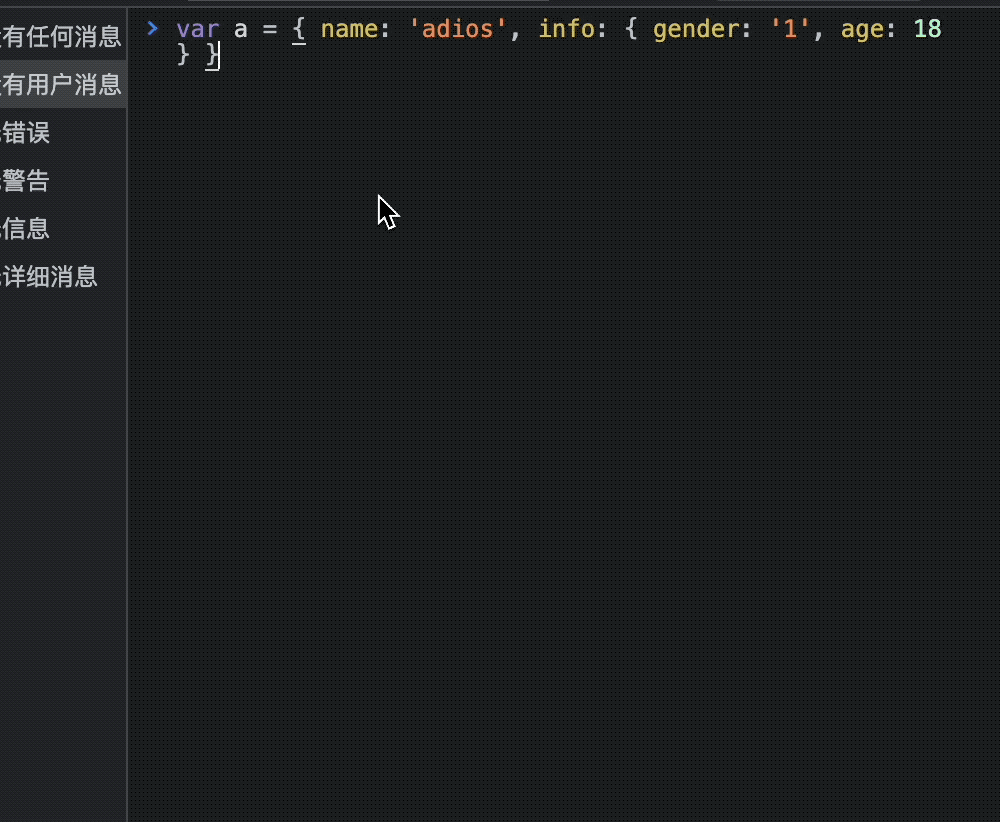

> 通常会与调试断点时拷贝变量值配合使用。

## debug(function) & undebug(function)

当调用指定的函数时，调试器将被调用，并会在 `Sources` 面板上的函数内部中断，从而能够单步执行代码并对其进行调试。

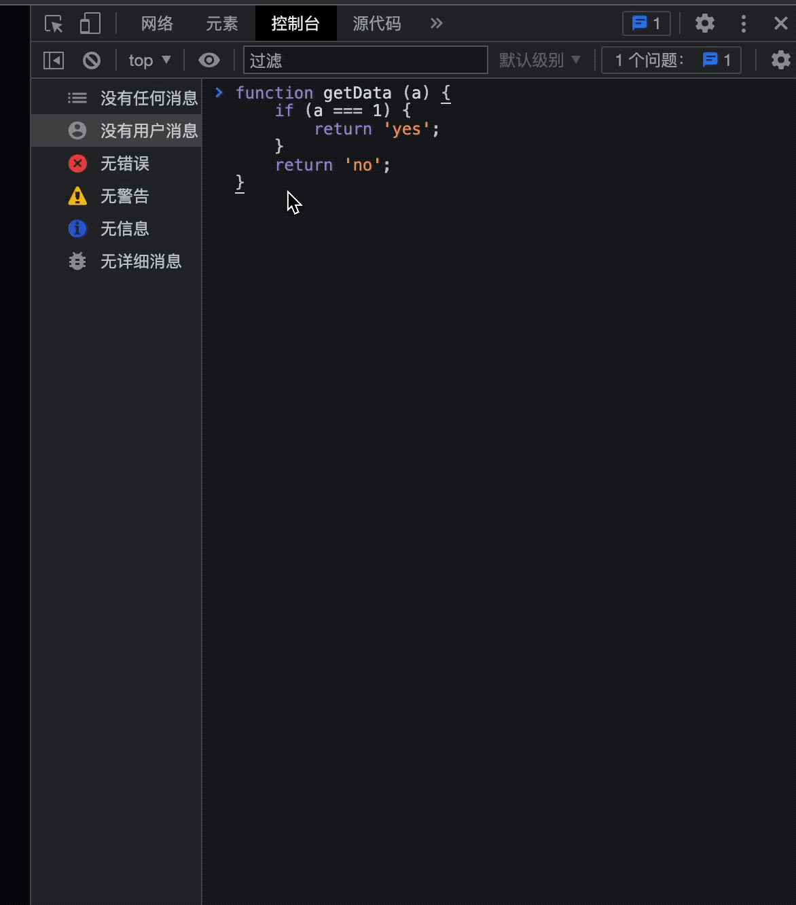

可以使用`undebug(function)`停止断点，或使用`Sources` 面板上的UI进行断点控制。

## dir(obj)

以对象形式显示指定对象的所有属性列表。此方法是 `console.dir()` 的别名。

下面的例子显示了直接打印`document.body`与使用`dir(document.object)`的区别：

```js
console.log(document.body); // 节点树

console.dir(document.body); // 对象节点
```

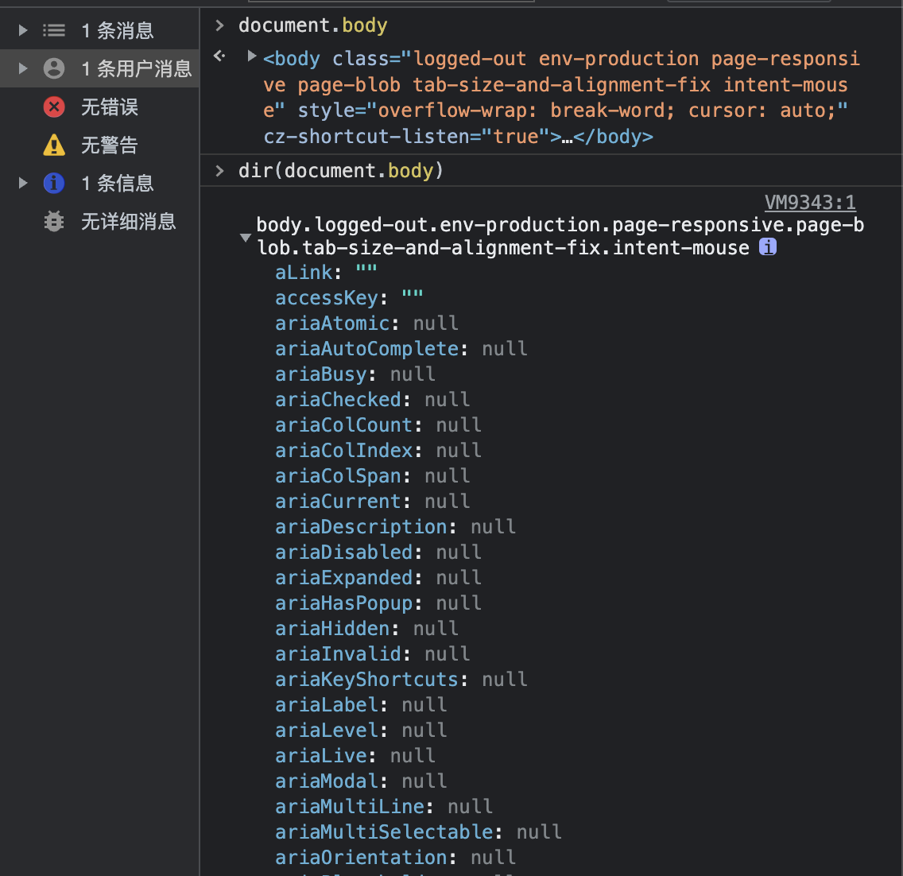

## dirxml(object)

打印指定对象的 `XML` 表示，如 `Elements` 选项卡中所示。此方法等价于 `console.dirxml()` 方法。

显示一个明确的 `XML/HTML` 元素的包括所有后代元素的交互树。如果无法作为一个 `element` 被显示，那么会以 JavaScript 对象的形式作为替代。它的输出是一个继承的扩展的节点列表，可以让你看到子节点的内容。

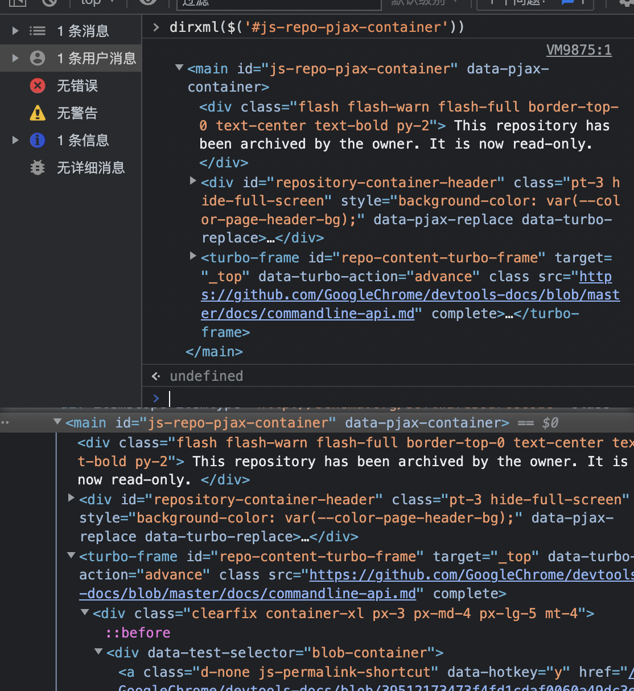

## inspect(object/function)

在适当的面板中打开并选择指定的元素或对象：若为DOM 元素，则打开 `Elements` 面板；若为 JavaScript 堆对象，则打开 `Profiles` 面板。

```js
inspect(document.body.firstChild);
```

当传递一个函数进行检查时，调用该函数时，它将在 `Sources` 面板中打开它供我们检查。

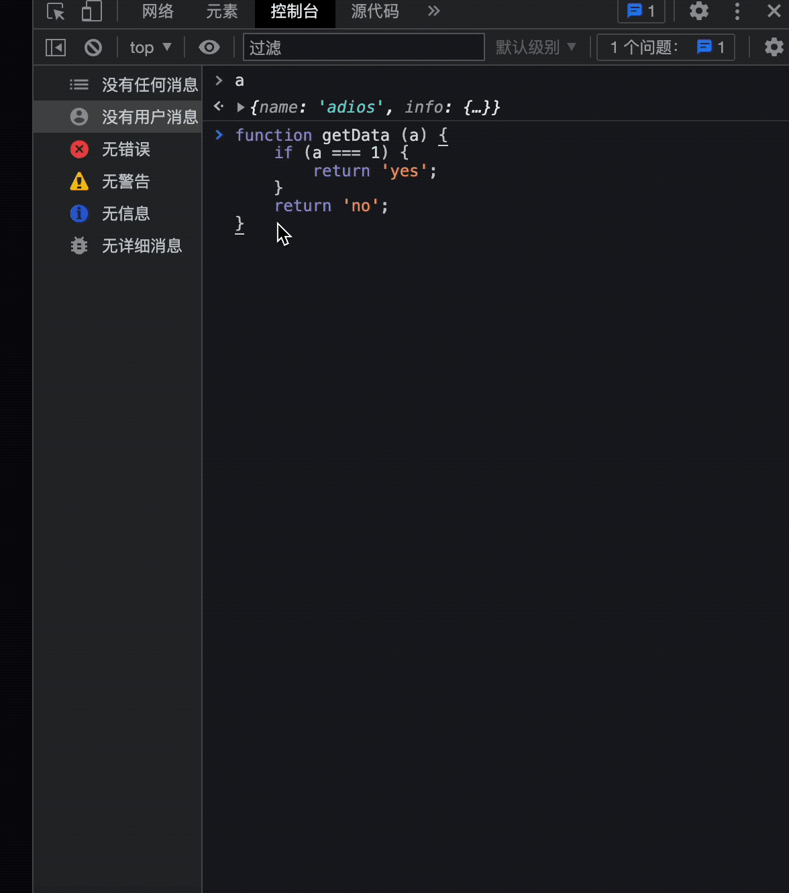

## getEventListeners(object)

返回在指定对象上注册的事件监听器。返回值是一个对象，包含每个注册的事件类型的数组（例如，"click"或 "keydown"）。每个数组的成员是描述为每种类型注册的监听器的对象。

例如，下面列出了在文档对象上注册的所有事件监听器。

```js
getEventListeners(document);
```

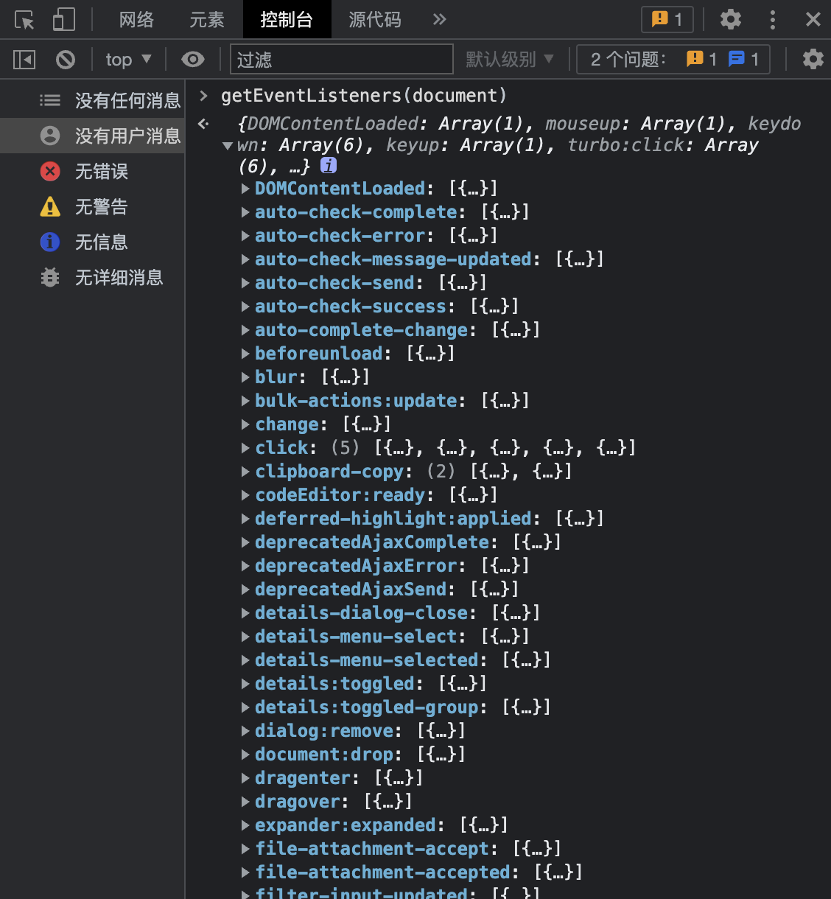

如果在指定的对象上注册了一个以上的监听器，那么这个数组就包含了每个监听器的成员。

## keys(object) & values(object)

`keys(object)`返回一个数组，其中包含属于指定对象的属性的键名。

`values(object)`返回一个数组，其中包含属于指定对象的属性的值。

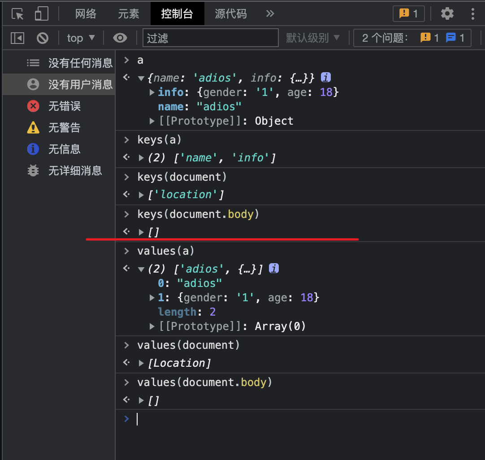

## monitor(function) & unmonitor(function)

当调用指定的函数时，控制台会记录一条消息，指示函数名称以及在调用函数时传递给函数的参数。

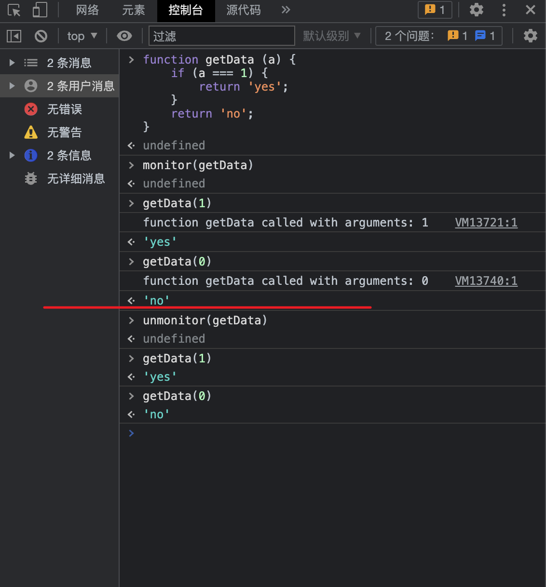

使用`unmonitor(function)`停止监视。

## monitorEvents(object[, events])

当一个指定的事件发生在指定的对象上时，事件对象被记录到控制台。你可以指定一个单一的事件来监视，一个事件数组，或者一个通用的事件 "类型"，这些事件被映射到一个预定义的事件集合。

如下监听了window的点击事件：

```js
monitorEvents(window, ["click"]);
```

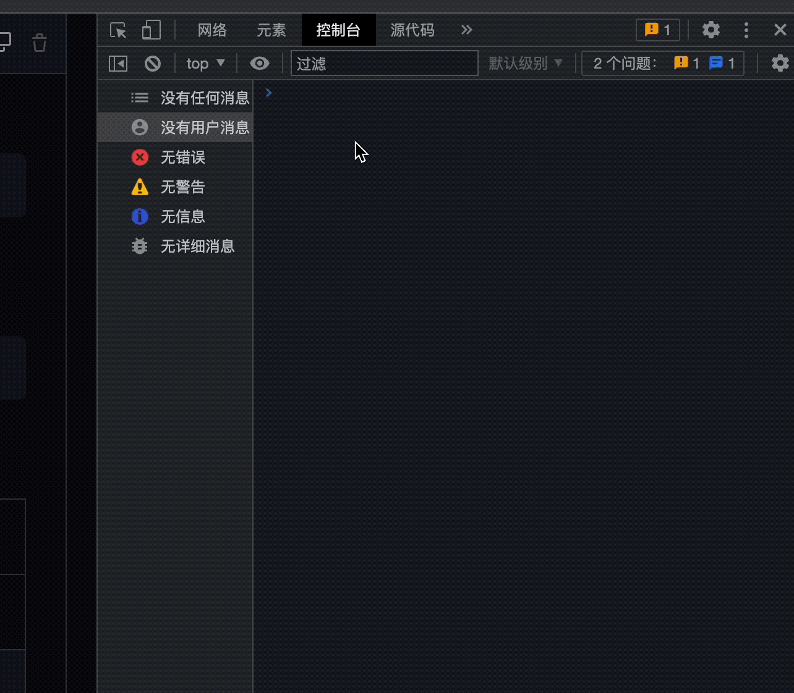

我们还可以指定一种可用的事件"类型"，即映射到预定义事件集的字符串。下表列出了可用的事件类型及其关联的事件映射：

| 事件类型 | 类型映射 |
| ----------- | ----------- |
| mouse | "click", "dblclick", "mousedown", "mouseeenter", "mouseleave", "mousemove", "mouseout", "mouseover", "mouseup", "mouseleave", "mousewheel" |
| keyboard | "keydown", "keyup", "keypress", "textInput" |
| touch | "touchstart", "touchmove", "touchend", "touchcancel" |
| control | "resize", "scroll", "zoom", "focus", "blur", "select", "change", "submit", "reset" |

例如，使用"key"事件类型监听 window 的所有对应键事件。

```js
monitorEvents(window, "key");
```

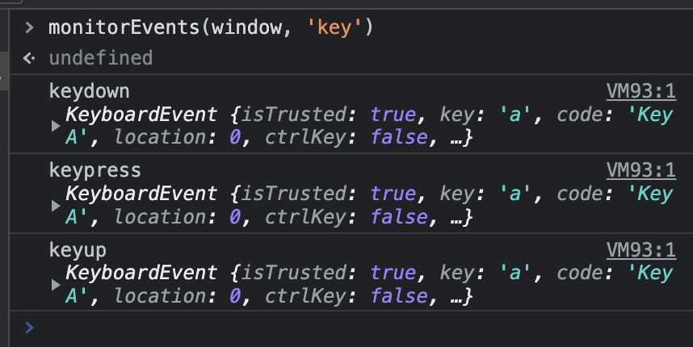

## unmonitorEvents(object[, events])

停止监视指定对象和事件的事件。

例如，停止对 window 对象的所有事件监视：

```js
unmonitorEvents(window);
```

你也可以有选择地停止监视一个对象上的特定事件。例如，下面的代码开始监视当前选定元素上的所有鼠标事件，然后停止监视 "mousemove "事件（也许是为了减少控制台输出的噪音）:

```js
monitorEvents($0, "mouse");
unmonitorEvents($0, "mousemove");
```

> 查看[更多示例](https://github.com/GoogleChrome/devtools-docs/blob/master/docs/console.md#monitoring-events)

## profile([name])

使用可选名称启动 `JavaScript CPU` 分析会话。若完成分析可调用`profileEnd([name])`;

开始分析:

```js
profile('test');
```

完成分析：

```js
profileEnd('test');
```

嵌套分析：

```js
profile('A');
profile('B');
profileEnd('A');
profileEnd('B');

// 性能分析报告"A"已开始。
// 性能分析报告"B"已开始。
// 性能分析报告"A"已完成。
// 性能分析报告"B"已完成。
```

> 在chrome浏览器上测试使用时似乎没有效果...需追踪和确认。

## profileEnd([name])

停止使用 `profile()` 方法启动的当前分析会话，并在 `Profiles` 面板中显示结果。

## table(data[, columns])

通过传入带有可选列标题的数据对象(对象数组或类对象数组)，使用表格记录对象数据。与`console.table()`方法等价。

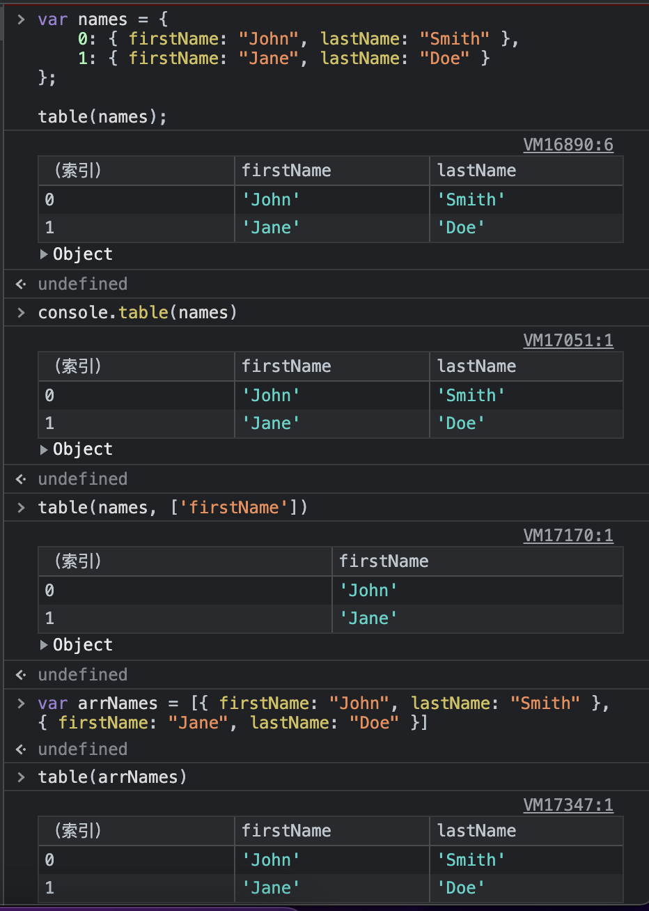

## 其他API

Chrome 扩展可以在命令行 API 中注入额外的辅助方法。例如，[Debug Utils 扩展](https://chrome.google.com/webstore/detail/debug-utils/djailkkojeahmihdpcelmmobkpepmkcl) ([github](https://github.com/amasad/debug_utils)) 提供了用于中断属性访问、事件触发和方法调用的钩子。

## 参考

- [commandline-api](https://github.com/GoogleChrome/devtools-docs/blob/master/docs/commandline-api.md)
