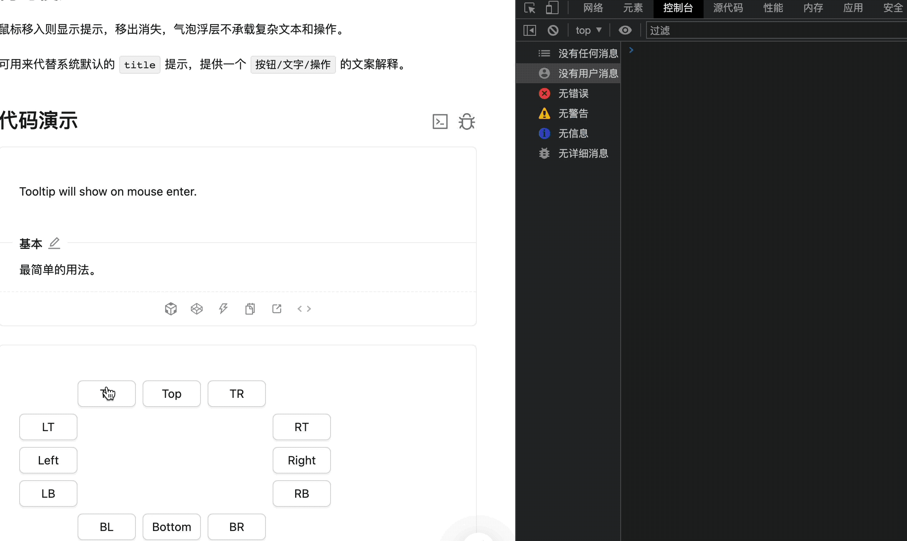

## 背景

我们知道，`antd`的`Tooltip`组件默认行为是鼠标进入时显示提示内容，鼠标移出时提示内容消失。假设这时候我们需要对显示提示内容的`div`进行样式微调，除了设置`<Tooltip visible={true} />`这种方式之外，还有其他方式可以审查这个`div`吗？

## 解决方法

一种比较简单有效的方法是使用`setTimeout`, 可以在控制台输入以下内容：

```js
setTimeout(() => { debugger; }, 2000);
```

然后在你设定的时间内，完成你的准备工作（让`DOM`节点显示）即可。

示例所示：



## 适用场景

- 使用审查元素无法选择到的DOM节点
- DOM节点跟随鼠标行为而变化
- 拖拽排序时的DOM节点（比如位置指示器）审查
- 动态生成与删除的节点
