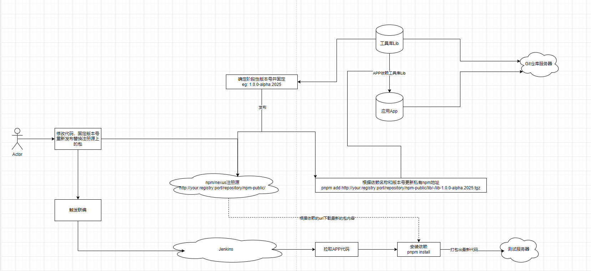

## 背景

在大项目开发过程中，每个成员所拥有的项目权限是不一样的，比如A同学负责一个工具库`Lib`的开发，B同学负责应用`App`的开发，此应用又依赖于A同学开发的`Lib`。A同学现在遇到的情况是：A在`Lib`中修复了某个缺陷，需要通过打包B同学的`App`并部署到测试环境`TestEnv`服务器上，但A同学受于权限的控制，无法访问到`App`的代码权限，又无法每次需要调试时都让B同学帮忙打包。

这时候A同学该怎么办？

## 总体方案

在公司的实际开发中，我们采用的是`pnpm`进行依赖管理。
方案流程描述如下：


### 发包策略

私有库`Lib`采用固定版本号进行发包，此版本号可以来自阶段性提测版本，每一个项目阶段开始时，就先确定下来一个版本号，比如`1.0.0-alpha.2025`，那么在这个项目阶段区间，这个版本号就不变了。

### 依赖处理

应用`App`根据固定的依赖版本号，以及`npm/nexus`注册源确定此项目阶段的依赖下载地址，如`http://your.registry:port/repository/npm-public/lib/-/lib-1.0.0-alpha.2025.tgz`。
使用如下命令添加`Lib`依赖：

```bash
pnpm add http://your.registry:port/repository/npm-public/lib/-/lib-1.0.0-alpha.2025.tgz
```

可以得到如下`package.json`:

```json
{
  "dependencies": {
    "lib": "http://your.registry:port/repository/npm-public/lib/-/lib-1.0.0-alpha.2025.tgz"
  }
}
```

然后提交代码到`git`仓库，之后，`Lib`的开发调试就无需负责`App`的同学参与了。

#### url管理依赖的优点

相较于传统的`pnpm add lib@1.0.0-alpha.2025`这种，使用`pnpm add [url_of_lib]`这种形式可以保证`jenkins`在执行`pnpm install`时不会从本机的`pnpm`缓存（通过`pnpm store path`命令可获取本地缓存目录位置）中获取内容。因为我们已经固定了`Lib`的阶段版本号，在版本号不变的情况下，`pnpm`始终会从缓存中添加依赖。

> 注意：经过测试，使用官方的`pnpm add lib@1.0.0-alpha.2025 --force`方式并无法保证依赖从注册源重新下载。若大家并无此问题，可以邮件告知我进行更新~
